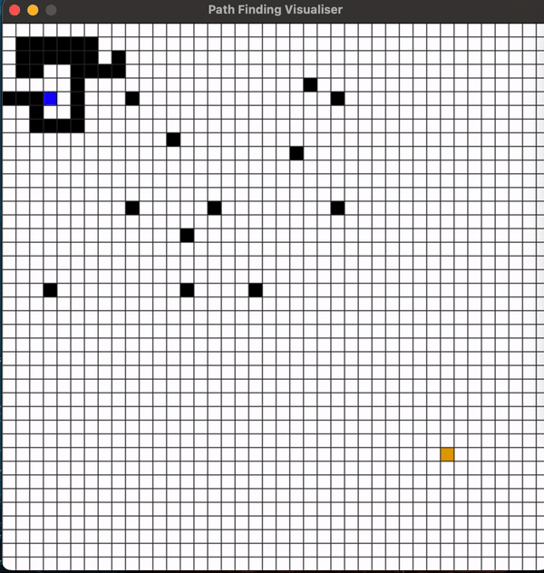

<h1 align="center">Path Finder</h1>


In order to run this visualiser, make sure to:

"pip3 install -r requirement.txt"

It is recommended that you create a virtual environment for this project but it is not required.

To run code:

```
python3 main.py
```
